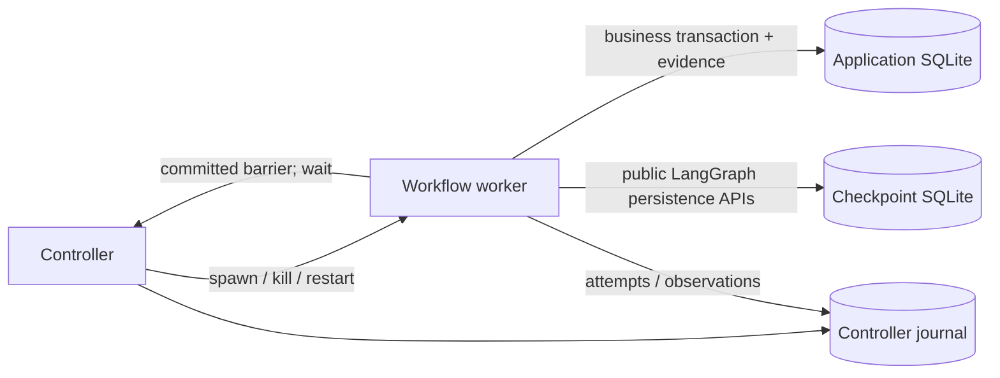

# Fracture

**Turn a LangGraph workflow test into recovery tests.** Fracture checks whether
execution failures and resumes duplicate writes, lose approved actions, or perform
unauthorized updates. It evaluates durable backend evidence using your business
assertions.

Fracture is a small open-source engineering tool. It does not prove production
safety, arbitrary business correctness, exhaustive coverage, or commercial demand.

## Quick start

Python 3.12 or 3.13, Windows or Linux. Install [uv](https://docs.astral.sh/uv/getting-started/installation/), then:

```console
git clone https://github.com/gowdu0/fracture.git
cd fracture
uv sync --frozen
uv run fracture demo
uv run fracture test fracture.demo:approved_change --output artifacts/run
uv run fracture replay artifacts/run/replay.json
uv run pytest
```

Alternatively, `python -m pip install .` installs the library and CLI from the
repository. Nothing is published to PyPI. The distribution is `fracture-recovery`;
the import and executable are `fracture`. An unrelated `fracture` distribution
already exists on PyPI; do not install that to obtain this project.

The demo runs offline after installation, with no model credentials. It exercises
an agent workflow's execution machinery using deterministic Python decisions.
Each command needs a **new output directory**; existing artifacts are preserved.

## What the demonstration establishes

The support workflow looks up a customer, creates a ticket, pauses for approval,
applies an authorized plan change, adds a note, and returns a structured outcome.
Its user-facing message is derived from that outcome.

| Scenario | Expected evidence |
| --- | --- |
| `approval_replay` | Normal approval resume creates two tickets; baseline fails without an injected fault |
| `split_only` | Moving ticket creation to its own node fixes the approval baseline, but lost responses and crashes still duplicate tickets |
| `approved_change` | Atomic, operation-scoped idempotency preserves one effect under all nine generated fault cases |
| `unauthorized`, `mismatched_unauthorized` | Protected effects lack matching affirmative approval; checker fails |
| `rejected`, `wrong_customer`, `wrong_parameters`, `wrong_operation` | No protected update occurs |
| `false_success` | Claimed success lacks a durable update; checker fails |
| `safe_failure` | A refused update produces an allowed failed outcome and no false success claim |
| `async_change` | Async action invocation and async SQLite checkpoint recovery pass |

Actual locally captured output, with verbose evidence omitted:

```text
Fracture: approval_replay
FAIL baseline: outcome=completed, validity=valid
  effect_count:change_request_001/create_ticket: expected 1..1 durable effects; actual 2
Exit code: 1
```

```text
Fracture: approved_change
PASS baseline: outcome=completed, validity=valid
PASS after_commit_process_exit-befd5a7b9dd3d055: outcome=completed, validity=valid
  Operation: change_request_001 / create_ticket / primary, attempt=1
  Fault: after_commit_process_exit; reached=True; applied=True
Exit code: 0
```

The corrected campaign observes nine boundaries and executes nine recovery cases:
three fault types at each of ticket creation, account update, and ticket note.
Baseline is reported separately. Multiple attempts with one durable effect pass.
See [captured evidence](docs/evidence.md) and [full demonstration output](docs/demo-output.txt).

`fracture demo` returns success when expected defects are detected **and** corrected
controls pass. `fracture test` returns failure when application assertions fail.
This makes planted defects useful CI tests without redefining normal test success.

## Python and pytest integration

```python
from fracture.demo import approved_change
from fracture.testing import assert_campaign


def test_recovery(tmp_path):
    scenario = approved_change()
    report = assert_campaign(scenario, tmp_path / "campaign")
    assert report.summary["passes"] == 9
```

For your own workflow, supply a `Scenario` with a workflow factory, resettable
`BackendFixture`, explicit recovery driver, approval inputs, and business
assertions. Factories and backend/driver objects must be spawn-picklable. Top-level
functions and dataclasses work; already-open connections and local workflow
factory closures do not. Ordinary local assertion closures work because assertions
execute in the controller. Fixture setup happens once per case; the worker opens
its own backend connections.

Register actions with `@action(site, identity=resolver, commit_visible=True)` or wrap
an existing callable. The resolver returns `(logical_operation, occurrence_key)`.
Call `observe_commit(receipt)` after a committed backend transaction; the fixture
must independently verify that receipt. Read-only actions can omit commit
visibility and support only `before_action` injection.

The working [integration contract](docs/integration.md) describes all interfaces,
snapshot fields, custom assertions, and subprocess constraints. A small
[pytest example](examples/test_existing_workflow.py) reuses the demo factory; it is
an API example, not independent validation.

## Fault placement and recovery

Supported faults:

- `before_action`: raise `TimeoutError` before calling the backend.
- `after_commit_response_lost`: verify a committed effect, then raise `TimeoutError`
  before returning success to the application.
- `after_commit_process_exit`: block at a verified post-commit barrier, kill the
  worker process, and optionally start a new worker using the configured driver.

The process-exit contract is validated for the bundled controllable SQLite fixture.
An external adapter must explicitly provide equivalent commit/barrier capabilities;
unsupported combinations are invalid, never substituted with another fault.



The application effect and its effect record commit atomically. Checkpoints use a
different database and transaction. At a crash barrier, the worker cannot return
from the action or checkpoint node completion. The controller verifies the effect,
records fault consumption, kills the worker, and records its exit code. A restart
preserves both databases and the thread ID and records the prior checkpoint and
new worker PID. It is not a new logical workflow.

`LangGraphDriver()` provides no error resumes and no crash restarts by default.
The demo explicitly chooses two timeout resumes and worker restarts. Approval
continuation uses `Command(resume=...)`; error/crash continuation uses `None` with
the same checkpoint thread. The executable semantics tests verify these behaviors.
Fracture does not silently add retries, idempotency, compensation, or exception
suppression. [LangGraph interrupt semantics](https://docs.langchain.com/oss/python/langgraph/interrupts)

## Assertions and evidence

| Assertion | Meaning |
| --- | --- |
| `effect_count` | Expected count/range for an operation, action, and matching parameters |
| `authorized_effect` | Every protected effect has an earlier affirmative approval bound to operation, resource, and parameters |
| `backend_state` | Selected final snapshot values match; selected unrelated values remain unchanged |
| `terminal_outcome` | Outcome is one of the explicitly permitted completed/interrupted/rejected/failed/recovery-exhausted values |
| `structured_claim_matches_state` | Each successful structured claim has a matching effect from this operation and matching final resource state |

Approval decisions and effects share a durable sequence in the **application**
fixture. An unauthorized change remains a violation even if later reverted.
A customer already on the requested plan does not prove this operation performed
an update. The fixture's unique idempotency key is stable across attempts; a new
key per attempt still yields duplicate business effects. Parameter changes under
an existing key are rejected.

Structured-claim assertions do not validate arbitrary prose. Required claims or
successful completion must also be enforced through your own applicable assertions.
Safe failure is expressible; recovery tests need not demand success after every fault.

## Coverage, reporting, and replay

Campaigns observe one baseline and expand only supported registered boundaries
on that trace. New paths, branches, and schedules encountered during recovery are
not recursively explored. Identity uses business operation, action site, occurrence,
and attempt; timestamps and global tool counters are not placement identifiers.

Failed baselines remain failures and normally stop expansion.
`continue_failed_baseline=True` explicitly enables educational diagnostic expansion.
The report keeps baseline failures distinct from injected-case failures.

Defaults: 100 completed node steps, 3 attempts per action occurrence, 2 worker
restarts, 32 injected cases, and a 60-second worker execution watchdog per case.
An oversized or empty campaign is invalid; nothing is silently truncated.
Application recovery exhaustion is an outcome; watchdog/controller failures make
the case invalid. Limits and driver configuration are recorded in each campaign.

Artifacts include `report.json` (schema version 1), `report.txt`, `timeline.txt`,
`replay.json` for importable scenario targets, and a directory for each case with
three SQLite stores and `case.json`. Reports include backend differences,
invariants, logical/attempt/effect identities, fault reach/application evidence,
PIDs, thread/checkpoint IDs, and explicit coverage denominators. Stores remain
available for diagnosis. Controller sequence is a useful local observation order,
not a total causal order for distributed systems.

Replay reconstructs a fresh fixture and checks normalized placement, effects, and
invariant results. It validates source/fixture hashes, Python and dependency
versions, checkpoint mode, approvals, and recovery settings. Git revision is
recorded as provenance; content hashes determine source compatibility. It excludes
raw PID/time/thread values from outcome comparison, preserving them in raw reports.
No random seed is recorded because the demo is deterministic.

Replay requires the original importable scenario factory and compatible source;
it does not bundle arbitrary application source or reproduce live LLM responses,
remote systems, timing, or concurrent schedules. In-memory scenarios without a
target can run campaigns but do not produce a replay specification. Source files
outside the inspected factory/adapter/assertion modules must be listed explicitly
in `Scenario.source_files`.

Exit codes: `0` all required cases valid and passed; `1` valid assertion failures;
`2` configuration/infrastructure errors, unsupported or unreached required faults,
or mixed invalid and failed cases. Existing output directories are rejected.

## Validation and compatibility

The library pins LangGraph **1.2.11** and `langgraph-checkpoint-sqlite` **3.1.1**.
Other framework versions are untested. The development environment is reproducible
through `uv.lock`. CI runs Ruff, mypy, behavioral tests, offline demos, replay, and
installation checks on Windows and Linux with Python 3.12 and 3.13. See
[validation evidence](docs/evidence.md) for actual observed results.

Milestone 2 is **incomplete**: three separately authored workflows were assessed,
but none satisfied the agreed independent write-recovery integration criteria.
[Candidate revisions and exact blockers](docs/independent-integration.md) are
documented. No independent defect discovery or adoption is claimed.

## Relationship to existing tools

- [Chaos Toolkit](https://github.com/chaostoolkit/chaostoolkit-lib) provides experiments
  with actions, probes, steady-state checks, and journals. Fracture specializes in
  expanding workflow test boundaries and checking operation-level durable effects.
- [LangSmith evaluation](https://docs.langchain.com/langsmith/evaluation-concepts)
  supports dataset experiments and code/human/model evaluators. Fracture focuses
  on controlled execution failures and backend assertions and can complement
  application-quality evaluation.
- [pytest monkeypatching](https://docs.pytest.org/en/stable/how-to/monkeypatch.html)
  supports replacing test dependencies. Fracture adds campaign enumeration,
  subprocess barriers, and durable-effect reports around explicit instrumentation.

These are scope comparisons, not claims that the other tools cannot implement
similar tests.

## Scope and next validation

V1 supports sequential sync/async Python callables and the local LangGraph
integration. Generators, streaming actions, concurrent execution, and multiple
commit observations in one action invocation are unsupported. Resettable fixture
adapters and their truthful evidence contracts are required.

Next: integrate a separately authored, licensed workflow with resettable business
writes, then ask prospective users to follow the [validation guide](docs/validation-guide.md).
Only observed integration needs should motivate broader adapters or a pytest plugin.

Deferred: hosted dashboards, authentication, billing, multi-tenancy, other agent
frameworks, YAML, randomized fuzzing, response corruption, latency simulation,
simultaneous resumes, multiple simultaneous faults, arbitrary crash positions,
and distributed concurrency testing.

Contributions: [CONTRIBUTING.md](CONTRIBUTING.md). License: [MIT](LICENSE).
